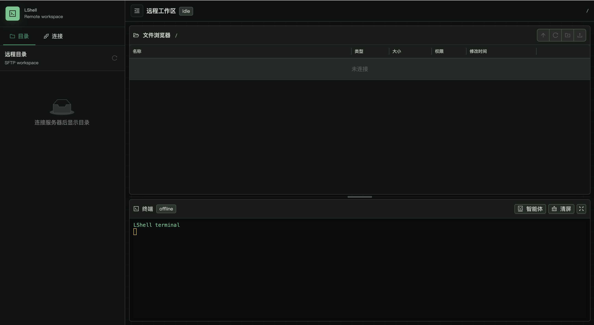
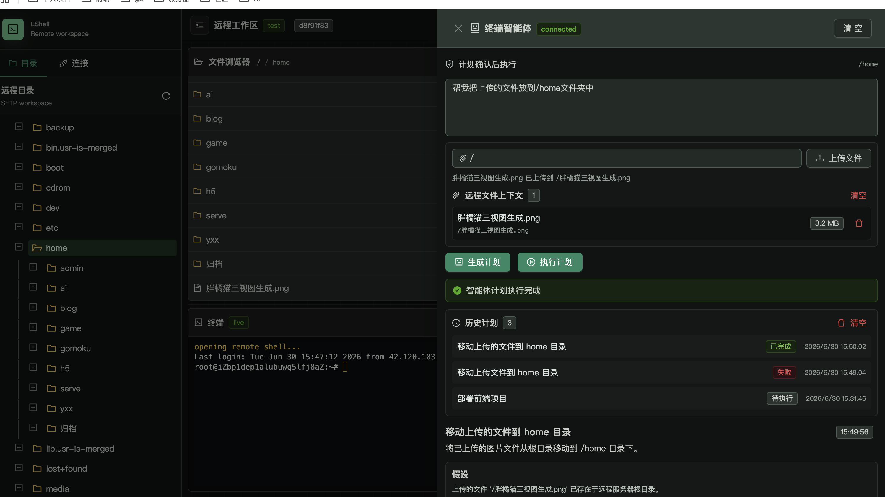

# LShell

LShell 是一个类似 FinalShell 的 Web 版远程服务器管理 MVP。当前实现采用计划中的方案 A：

- 前端：React + TypeScript + Ant Design + xterm.js
- 后端：Node.js + Express + ssh2 + ws
- 实时通信：WebSocket

## 当前功能

- SSH 密码认证与私钥认证
- 远程 shell 终端
- SFTP 目录浏览
- 文本文件读取与保存
- 小文件上传与下载
- 千问驱动的终端智能体：把自然语言意图流式转换为待确认命令计划，按步骤执行并实时展示 stdout/stderr
- 智能体内上传本地文件到指定远程目录，并把上传后的远程路径作为部署/解压/发布计划上下文
- 智能体历史计划本地暂存，默认保留最近 20 条，后续可替换为后端数据库
- 连接资料本地保存（不保存密码和私钥内容）
- 刷新页面后自动恢复同一浏览器标签页内的 SSH 连接
- WebSocket 心跳与空闲会话清理

## 运行界面

主工作区采用左侧连接/目录树、右侧文件管理器与终端上下分栏的布局，适合在同一个页面完成远程文件浏览、编辑、上传下载和 shell 操作。



终端智能体以抽屉形式叠加在工作区右侧，支持上传本地文件到指定远程目录、生成待确认计划、查看执行结果和历史计划。



## 启动

```bash
npm install
npm run dev:backend
npm run dev:frontend
```

默认地址：

- 前端：http://127.0.0.1:5173
- 后端：http://127.0.0.1:8080
- WebSocket：ws://127.0.0.1:8080/ws

## 构建

```bash
npm run build
```

## 环境变量

复制 `.env.example` 到 `.env` 后可调整：

```bash
PORT=8080
HOST=127.0.0.1
FRONTEND_ORIGIN=http://127.0.0.1:5173
VITE_WS_URL=ws://127.0.0.1:8080/ws
QWEN_API_KEY=your_dashscope_api_key
QWEN_MODEL=qwen-plus
QWEN_BASE_URL=https://dashscope.aliyuncs.com/compatible-mode/v1
QWEN_TIMEOUT_MS=30000
QWEN_STREAM=true
```

## 安全边界

这是本地/内网 MVP。生产部署前需要补齐：

- HTTPS/WSS
- 凭据加密存储或系统 Keychain
- 操作审计
- 用户与权限体系
- 上传/下载分片、断点续传与大小限制策略

终端智能体的执行边界：

- 千问只生成 JSON 计划，不直接执行命令
- 计划生成使用流式输出展示模型草稿，但只有后端成功解析并安全校验后的结构化计划可以执行
- 前端展示命令、风险和安全提示，用户确认后才执行
- 智能体上传区会先把本地文件通过 SFTP 上传到指定远程目录，目录不存在时后端会递归创建；计划生成时只会把上传后的远程路径传给千问
- 后端会在执行前重新校验计划，并阻断 `rm -rf /`、磁盘格式化、关机重启、fork bomb、覆盖系统认证文件等危险命令
- 单条命令默认 120 秒超时、256KB 输出上限；stdout/stderr 会通过 WebSocket 实时推送，命令在当前远程目录下执行
- 历史计划暂存在浏览器 `localStorage`，不包含 SSH 密码或私钥；需要团队共享、审计和长期保留时再迁移到数据库
- 当前上传通道沿用 WebSocket base64 + SFTP 写入，适合小/中等压缩包；超大前端包后续应升级为分片上传或断点续传

## 刷新恢复说明

前端只在 `sessionStorage` 中保存后端 SSH 会话 ID，不保存密码和私钥。刷新页面后会自动 attach 回后端已有 SSH session；如果后端服务重启或会话空闲超过 10 分钟，需要重新连接。终端窗口会重新打开，SSH 连接本身会保留。

## 目录

```text
backend/   Node.js API、SSH/SFTP、WebSocket
frontend/  React 工作台、终端、文件管理器
electron/  桌面端后续占位
```
